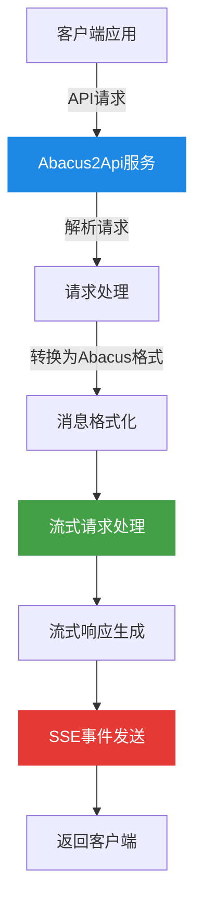
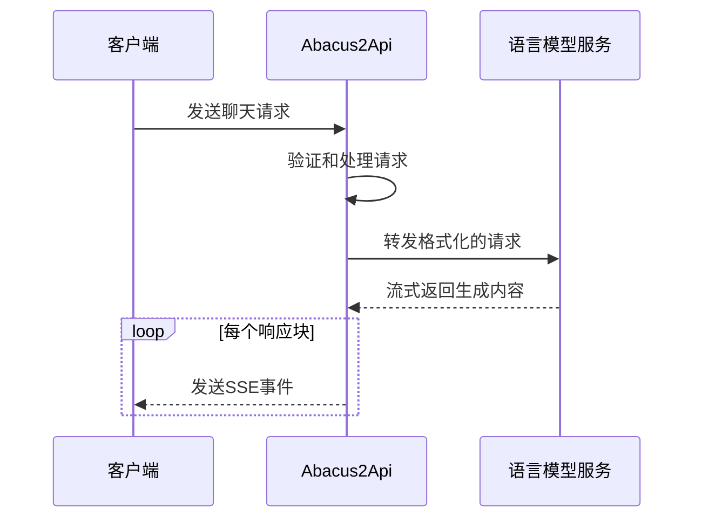

# Abacus2Api

<div align="center">


[](https://fastapi.tiangolo.com/)
[](https://www.python.org/)
[](LICENSE)

_✨ 一个API代理服务 ✨_

</div>

## 📖 项目介绍

Abacus2Api是一个基于FastAPI构建的API代理服务，它提供了一个统一的接口来与各种大型语言模型(LLM)进行流式交互。该服务完全兼容OpenAI API格式，让您可以轻松地将现有应用与不同的AI模型集成。

### 主要特性

- 🚀 兼容OpenAI API格式
- 🌊 原生支持流式(Stream)响应
- 🔄 统一接口访问多种LLM模型
- 🛡️ 内置错误处理和异常管理
- 🌐 支持CORS，方便前端集成

## 🔧 系统架构



## 💻 安装指南

### 前置条件

- Python 3.8+
- pip (Python包管理工具)

### 安装步骤

1. 克隆仓库

```bash
git clone https://github.com/yourusername/abacus2api.git
cd abacus2api
```

2. 创建并激活虚拟环境（可选但推荐）

```bash
# Windows
python -m venv venv
venv\Scripts\activate

# macOS/Linux
python -m venv venv
source venv/bin/activate
```

3. 安装依赖

```bash
pip install -r requirements.txt
```

## 🚀 使用方法

### 启动服务

```bash
uvicorn main:app --reload --host 0.0.0.0 --port 8000
```

服务将在 `http://localhost:8000` 上运行。

### API端点

#### 健康检查

```
GET /
```

#### 获取可用模型列表

```
GET /v1/models
```

#### 创建聊天完成（流式响应）

```
POST /v1/chat/completions
```

请求体示例:

```json
{
  "messages": [
    {
      "role": "system",
      "content": "你是一个有用的AI助手。"
    },
    {
      "role": "user",
      "content": "你好，请介绍一下自己。"
    }
  ],
  "model": "gpt-3.5-turbo",
  "stream": true
}
```

## 📊 请求流程



## 📄 许可证

本项目基于MIT许可证发布 - 详情请查看[LICENSE](LICENSE)文件。

---

<div align="center">
Made with ❤️ by Abacus Team
</div>
